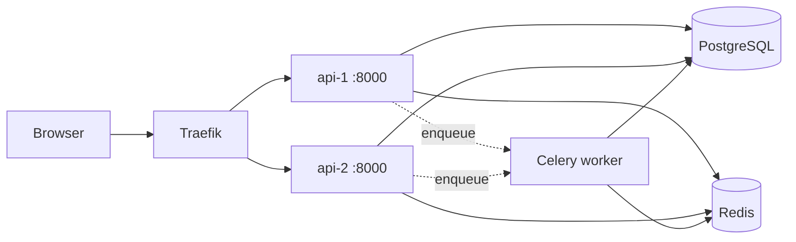

# Architecture Overview

#architecture

## What this system is

A **university LMS-lite**: courses, enrollments, assignments, file/text submissions, plagiarism batch job, live lecture chat, grades, CSV export, admin user management, course materials.

**Stack:**

| Layer | Technology |
|-------|------------|
| UI | React (Vite) SPA, built into API static folder |
| API | FastAPI, 2 replicas behind Traefik |
| Primary DB | PostgreSQL 16 |
| Secondary store | Redis 7 (cache, pub/sub, Celery broker) |
| Batch worker | Celery |
| Gateway | Traefik v3 (load balance, single public port) |

---

## High-level diagram

---

## Request paths

1. **Browser → Traefik :80** — Host header must match `infra/traefik/dynamic/routes.yml` (e.g. `university-lms.mooo.com`).
2. **Static SPA** — `GET /`, `/courses/1`, etc. → `SpaStaticFiles` returns `index.html` for client routes (`services/api/app/spa_static.py`).
3. **REST** — paths starting with `/api` → FastAPI routers (`services/api/app/main.py`).
4. **WebSocket** — `/ws/lectures/{course_id}?token=JWT` (not under `/api`).
5. **OpenAPI** — `/docs`, `/openapi.json` (FastAPI built-in).
6. **Health** — `/health/live`, `/health/ready` (Postgres + Redis check on ready).
7. **Metrics** — `/metrics` (Prometheus instrumentator).

---

## Code layout (backend)

| Path | Purpose |
|------|---------|
| `services/api/app/main.py` | App factory, middleware, router mount, SPA mount |
| `services/api/app/config.py` | Pydantic settings from `.env` |
| `services/api/app/db.py` | SQLAlchemy engine + `get_db` dependency |
| `services/api/app/redis_client.py` | Sync Redis client |
| `services/api/app/routers/*.py` | REST endpoints |
| `services/api/app/services/*.py` | Business helpers (cache, chat, file storage) |
| `services/api/app/models/*.py` | ORM tables |
| `services/api/app/auth/` | JWT + `CurrentUser` dependency |
| `services/api/app/ws/` | WebSocket endpoint |
| `services/api/app/celery_worker.py` | Celery app + plagiarism task |
| `services/api/app/from_scratch/` | Snowflake ID + rate limiter (R11) |
| `services/api/app/telemetry.py` | OpenTelemetry + Prometheus (R12) |
| `services/api/alembic/versions/` | Migrations |

---

## Code layout (frontend)

| Path | Purpose |
|------|---------|
| `services/web/src/App.tsx` | React Router routes |
| `services/web/src/api.ts` | `fetch` wrapper + types |
| `services/web/src/auth/AuthContext.tsx` | JWT in `localStorage`, `/api/auth/me` |
| `services/web/src/components/AppLayout.tsx` | Sidebar nav + top bar |
| `services/web/src/pages/*.tsx` | Screens per role |

Build: Docker multi-stage copies `services/web` build → `services/api/static/`.

---

## Polyglot persistence (R5) — one sentence each

- **PostgreSQL:** users, courses, enrollments, assignments, submissions, grades, chat history, materials metadata — **ACID, joins, durable**.
- **Redis:** admin course list **cache** (120s TTL), lecture **pub/sub** for multi-replica WebSocket, Celery **queue** — **fast, ephemeral / messaging**.

See [[Redis Cache and PubSub]].

---

## Multi-replica behaviour

- **api-1** and **api-2** are identical; Traefik round-robins.
- **Snowflake:** each replica has unique `WORKER_ID` (1 and 2) so submission `public_id` never collides.
- **WebSocket:** message published to Redis channel `lms:lecture:{course_id}`; both replicas subscribed clients receive it.
- **Course cache:** shared Redis key — either replica can HIT/MISS.

---

## What is NOT in v1

See `FUNCTIONAL_SPEC.md` Tier 3: OAuth, email notifications, content module versioning, full audit log UI.

---

## Related notes

- [[Authentication and Authorization]]
- [[Docker Compose and Traefik]]
- [[Rubric R1-R13 Evidence]]
