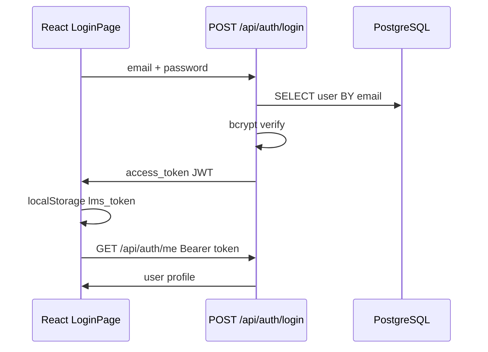

# Authentication and Authorization

#auth

## Login flow (end-to-end)



### Backend files

| File | Role |
|------|------|
| `services/api/app/routers/auth.py` | `POST /login`, `GET /me` |
| `services/api/app/auth/security.py` | `hash_password`, `verify_password`, `create_access_token`, `decode_access_token` |
| `services/api/app/auth/deps.py` | `get_current_user`, `require_roles`, `CurrentUser` dataclass |
| `services/api/app/auth/roles.py` | Constants: `student`, `lecturer`, `admin` |

### JWT payload

Created in `create_access_token`:

- `sub` — user id (string)
- `role` — student | lecturer | admin
- `email`
- `exp` — expiry (`JWT_EXPIRE_HOURS`, default 24h)
- Signed with **HS256** and `JWT_SECRET` from env

### Password storage

- **bcrypt** hashes in `users.password_hash` (seed uses one hash for `demo1234`).
- `verify_password` rejects invalid bcrypt strings safely.

### Protecting routes

Most endpoints use:

```python
user: CurrentUser = Depends(get_current_user)
```

Admin-only:

```python
_admin: CurrentUser = Depends(require_roles(roles.ADMIN))
```

`HTTPBearer` reads `Authorization: Bearer <token>`; missing/invalid → **401**.

### WebSocket auth

Browsers cannot set custom headers on WebSocket easily, so:

- `services/api/app/ws/lecture.py` accepts `?token=<JWT>` query param.
- Same `decode_access_token` as REST.
- Then checks `can_access_lecture` (enrolled, instructor, or admin).

### Frontend

| File | Behaviour |
|------|-----------|
| `services/web/src/auth/AuthContext.tsx` | Stores token in `localStorage` key `lms_token` |
| `services/web/src/api.ts` | `authHeaders()` adds Bearer to every API call |
| `services/web/src/App.tsx` | `Protected` wrapper redirects to `/login` if no user |

---

## Authorization rules (who can do what)

| Action | student | lecturer | admin |
|--------|---------|----------|-------|
| List own enrolled courses | yes | own taught | all |
| Catalog (all courses) | `?catalog=true` | — | — |
| Create course | no | no | yes |
| Enroll self | yes | no | no |
| Enroll another user | no | own course | yes |
| Create assignment | no | own course | no |
| Submit assignment | enrolled | no | no |
| Grade submission | no | own course | yes |
| View all submissions | no | own assignment | yes |
| Lecture chat | enrolled | instructor | yes |
| Manage users | no | no | yes |
| Course materials | view if enrolled | manage own | manage all |

Implementation is **per router** (not a central policy engine). Example: `courses.py` `_assert_course_staff`, `assignments.py` `_can_view_assignment`.

---

## Security notes for viva

- Change `JWT_SECRET` on production VM (not default `change-me-in-production`).
- Rate limiter: `from_scratch/rate_limiter.py` — ~100 req/min per IP, returns 429.
- Material file download via `<a href>` may **omit JWT** — known gap; API endpoint itself requires auth.

---

## Rubric link

- **R4** — auth endpoints documented in OpenAPI.
- **R1** — actors: Student, Lecturer, Admin in requirements.

See [[REST API Reference]], [[Rubric R1-R13 Evidence]].
