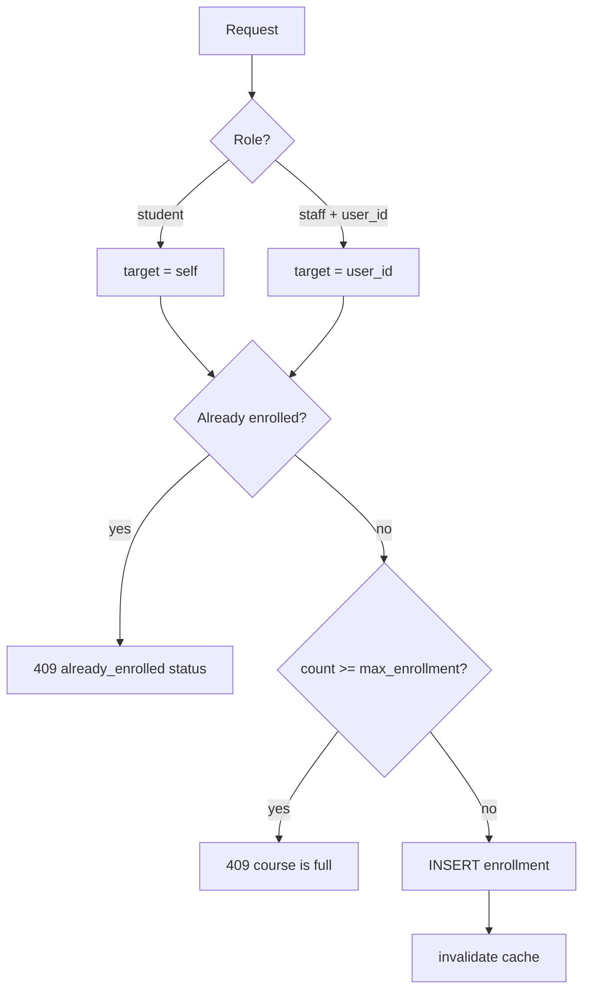

# Courses and Enrollments

#api #courses

**Main file:** `services/api/app/routers/courses.py`  
**Cache:** `services/api/app/services/courses_cache.py`  
**UI:** `services/web/src/pages/CoursesPage.tsx`, `CoursePage.tsx`, `AdminCreateCoursePage.tsx`

---

## List courses `GET /api/courses`

### Who sees what

| Role | Default list | `?catalog=true` (students only) |
|------|--------------|-------------------------------|
| admin | all courses | N/A |
| lecturer | courses where `instructor_id = me` | N/A |
| student | **enrolled only** | **all courses** + `is_enrolled` flag |

### Query parameters

- `q` — search **code or title** (not description)
- `skip_cache=true` — admin bypass Redis (for R6 benchmarks)
- `catalog=true` — student catalog mode

### Admin cache (R5/R6)

1. First admin request (no `q`, no catalog): query DB → `set_cached_course_list` → header `X-Cache: MISS`
2. Next requests within **120s**: read Redis key `lms:v1:courses:list` → `X-Cache: HIT`
3. **Invalidated** on: create/patch course, enroll, unenroll (`invalidate_course_list_cache()`)

### Response fields (important for viva)

Each course includes:

- `max_enrollment`, `enrollment_count`
- Student catalog: `is_enrolled`
- Course detail: `is_full` (= count >= max)

---

## Create course `POST /api/courses` (admin)

Body: `code`, `title`, `description`, `instructor_id`, `max_enrollment` (default 30).

Steps:

1. Verify lecturer exists and `role == lecturer`
2. Unique `code` or 409
3. Insert `Course`, `ensure_room_for_course` (creates `chat_rooms` row)
4. Invalidate cache

---

## Enroll `POST /api/courses/{id}/enrollments`

- Counts only **students** (`User.role == student`) toward capacity.
- Staff must send `{ "user_id": N }`; students send `{}`.

---

## Course detail `GET /api/courses/{id}`

- Admin / instructor: always `is_enrolled: true` (staff view)
- Student: `is_enrolled` from enrollment row

---

## Frontend behaviour

- **CoursesPage:** search debounced 300ms; shows `enrollment_count / max_enrollment`
- **CoursePage:** hero with Enrolled pill; enroll button disabled if `is_full`
- **Admin:** collapsible "Course administration" — professor SearchableSelect + max enrollment

---

## Rubric

- **R5** — cache in Redis
- **R6** — measure with/without cache (`skip_cache`, `X-Cache` header)
- Scenario use cases: enroll, browse catalog

See [[Redis Cache and PubSub]], [[Rubric R1-R13 Evidence]].
