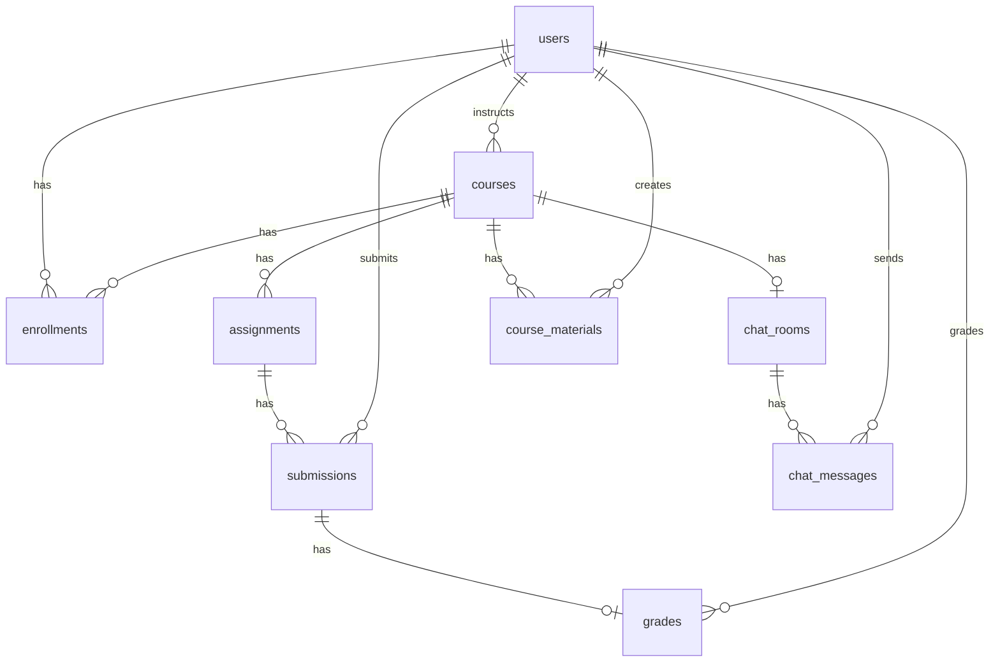

# Database Schema and Migrations

#postgres #database

## ORM location

All models: `services/api/app/models/`  
Alembic: `services/api/alembic/versions/`  
Seed: `scripts/seed.sql`

---

## Tables and relationships

### `users`

- `email` (unique), `full_name`, `password_hash`, `role`, `is_active`
- Roles: `student`, `lecturer`, `admin`

### `courses`

- `code` (unique), `title`, `description`, `instructor_id` → `users.id`
- `max_enrollment` (capacity limit, migration `20260518_0007`)

### `enrollments`

- `user_id`, `course_id`, `created_at`
- **Unique** `(user_id, course_id)` — one enrollment per student per course

### `assignments`

- `course_id`, `title`, `description`, `due_at`

### `submissions`

- `assignment_id`, `student_id`, `body_text`, file metadata columns
- `public_id` — **Snowflake** 64-bit unique (not DB autoincrement)
- `plagiarism_status`, `plagiarism_score`, `scanned_at`
- **Unique** `(assignment_id, student_id)` — one submission per student; resubmit **updates** same row

### `grades`

- `submission_id` (unique), `score`, `feedback`, `graded_by_id`, `graded_at`

### `chat_rooms`

- `course_id` (unique) — one room per course

### `chat_messages`

- `room_id`, `sender_id`, `content`, `sent_at`, `is_pinned`

### `course_materials`

- `course_id`, `title`, `description`, `kind` (`file` | `link` | `note`)
- File: `file_path`, `file_name`, `file_size_bytes`, `file_content_type`
- Link: `external_url`
- Note: `body_text`
- `created_by_id` → `users.id`

---

## ER diagram (study for hand-drawn version)

**R2 requirement:** PDF must have **hand-drawn ER**, not only this Mermaid export.

---

## Migration chain (order matters)

| Revision | File | Adds |
|----------|------|------|
| 0001 | `20260511_0001_initial_users.py` | users |
| 0002 | `20260511_0002_lms_core.py` | courses, enrollments, assignments, submissions |
| 0003 | `20260515_0003_auth_and_grades.py` | password_hash, grades |
| 0004 | `20260516_0004_chat_rooms_and_file_submissions.py` | chat, submission files |
| 0005 | `20260516_0005_unique_submission_per_student.py` | unique constraint |
| 0006 | `20260517_0006_course_materials.py` | course_materials |
| 0007 | `20260518_0007_course_max_enrollment.py` | max_enrollment |

**One-command DB:** `migrate` service runs `alembic upgrade head` in Docker Compose.

---

## Indexes (optimisation)

Check migrations for `ix_*` on foreign keys (`user_id`, `course_id`, etc.). Mention in **R6** report if you measure query plans.

---

## Seed data

`scripts/seed.sql`:

- 9 users (1 admin, 3 lecturers, 5 students)
- 6 courses with varied `max_enrollment`
- Enrollments, assignments, sample submissions, grades, chat, materials

---

## Rubric

- **R3** — PostgreSQL + Alembic + seed + compose `migrate` service
- **R2** — schema narrative + hand ER in PDF

See [[Courses and Enrollments]], [[Rubric R1-R13 Evidence]].
