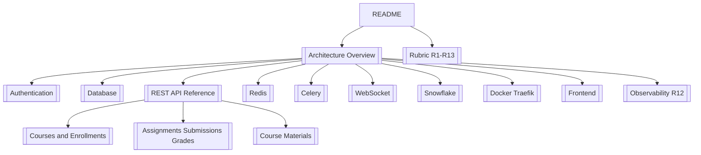

# LMS Lite — Viva preparation vault

Open this folder in **Obsidian** (`File → Open folder as vault` → select `docs/viva-vault`).

**Deployed app:** http://university-lms.mooo.com  
**API docs:** `/docs` on same host  
**Demo logins:** see [[Demo Accounts]] or repo `DEMO_ACCOUNTS.md`

---

## Start here

| If the examiner asks… | Read |
|----------------------|------|
| "Walk through the architecture" | [[Architecture Overview]] |
| "How does login work?" | [[Authentication and Authorization]] |
| "Explain the database" | [[Database Schema and Migrations]] |
| "List your endpoints" | [[REST API Reference]] |
| "Why Redis?" | [[Redis Cache and PubSub]] |
| "Explain the batch pipeline" | [[Celery Plagiarism Pipeline]] |
| "How does live chat work?" | [[WebSocket Lecture Chat]] |
| "What did you build from scratch?" | [[Snowflake IDs and Rate Limiter]] |
| "Docker / gateway / TLS" | [[Docker Compose and Traefik]] |
| "Frontend?" | [[Frontend React Application]] |
| "Observability?" | [[Observability R12]] |
| "R1–R13 mapping" | [[Rubric R1-R13 Evidence]] |
| Quick fire questions | [[Viva Q&A Cheat Sheet]] |
| Live demo order | [[Demo Script]] |

---

## Team ownership (for viva)

Align with `LINKS.txt` and your PDF team table:

| Member | Own these areas in code |
|--------|-------------------------|
| Person 1 | `alembic/`, `app/models/`, `scripts/seed.sql`, ER diagram |
| Person 2 | `app/routers/`, `app/ws/`, OpenAPI, WebSocket paragraph |
| Person 3 | `courses_cache.py`, `lecture_chat.py`, `celery_worker.py`, Redis/Celery |
| Person 4 | `docker-compose*.yml`, `infra/`, `telemetry.py`, deploy, Grafana |

Each person must explain **their** files without reading slides.

---

## Map of notes

---

## Tags (Obsidian)

Use tags when searching: `#auth` `#postgres` `#redis` `#celery` `#websocket` `#rubric` `#deploy`
