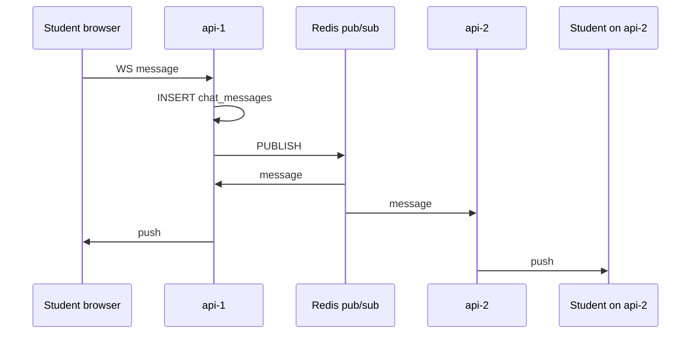

# WebSocket Lecture Chat

#websocket #r7

**WS endpoint:** `services/api/app/ws/lecture.py`  
**Logic:** `services/api/app/services/lecture_chat.py`  
**UI:** `services/web/src/pages/LecturePage.tsx`  
**Test script:** `scripts/test_ws_lecture.py`

---

## URL

```
ws(s)://HOST/ws/lectures/{course_id}?token=<JWT>
```

Built in frontend: `api.ts` → `wsLectureUrl(courseId, token)`.

Traefik routes WebSocket upgrades to same `api-1` / `api-2` pool.

---

## Connection lifecycle

1. **Validate JWT** from query (`_user_from_token`)
2. **Check access** — `can_access_lecture`: admin, instructor, or enrolled student
3. `websocket.accept()`
4. Create two async Redis connections (pub + sub) on `REDIS_URL`
5. `SUBSCRIBE lms:lecture:{course_id}`
6. Start asyncio task `_redis_pump` — forwards Redis messages to WebSocket
7. Loop: receive text from client → `persist_message` (Postgres) → `PUBLISH` to channel
8. On disconnect: cancel pump, unsubscribe, close

---

## Message format (JSON)

```json
{
  "id": 123,
  "user": "Ada Lovelace",
  "text": "Hello",
  "sent_at": "2026-05-16T12:00:00+00:00",
  "is_pinned": false
}
```

---

## REST history

Before/after WS session, UI can load:

`GET /api/courses/{course_id}/lecture/messages` — last 500 messages from Postgres.

---

## Multi-replica diagram



---

## Why WebSocket (R7 paragraph)

> REST polling would add latency and load for live lecture Q&A. WebSockets give full-duplex push suitable for chat. We still persist every message in PostgreSQL for history and use Redis pub/sub only for real-time fan-out across horizontally scaled API instances.

---

## Rubric

- **R7** — non-REST meaningful use
- **R5** — Redis pub/sub

See [[Redis Cache and PubSub]], [[Rubric R1-R13 Evidence]].
